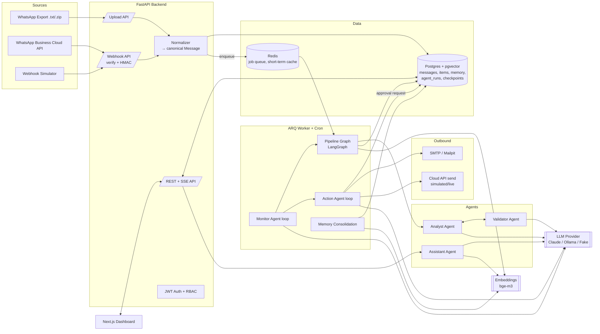
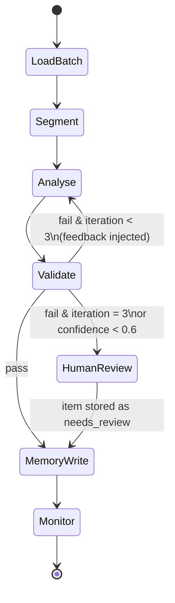
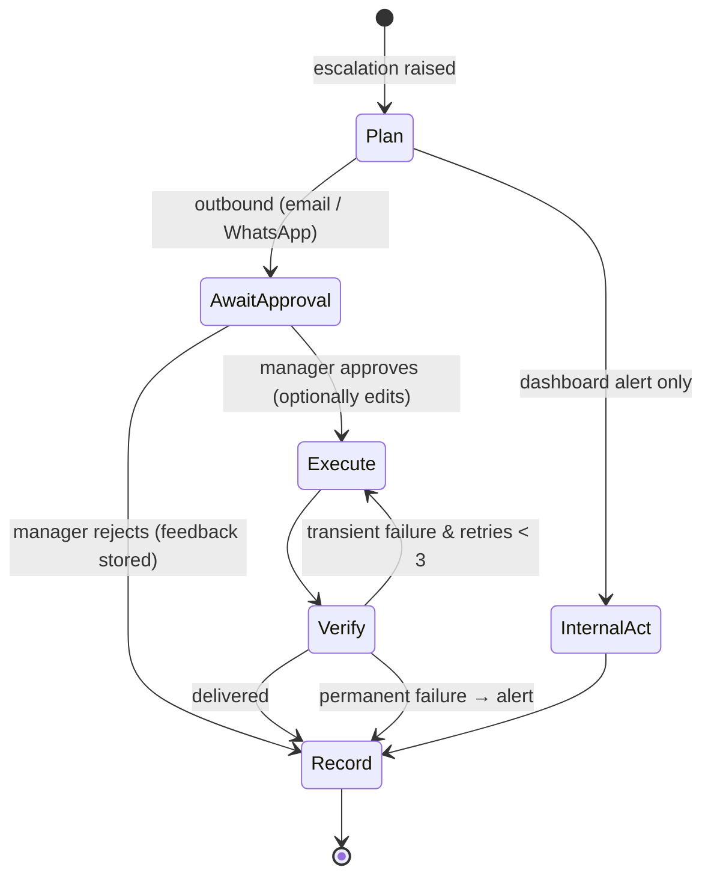
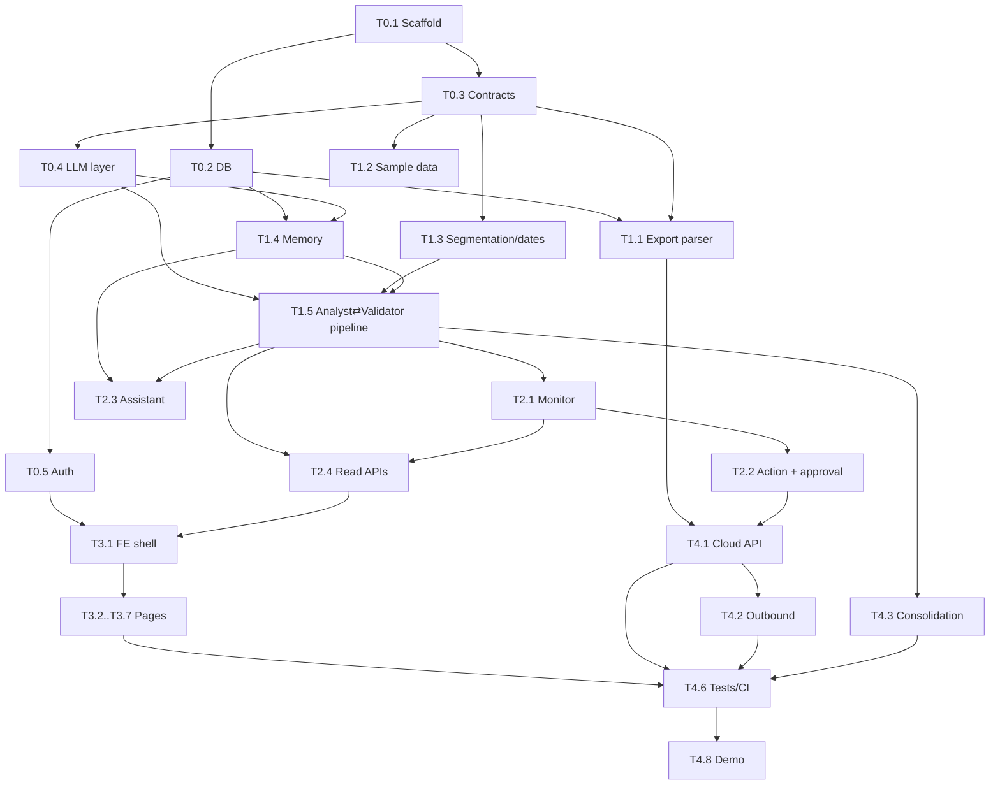

# Agentic WhatsApp Intelligence & Management Dashboard: Development Plan


---

## 1. Goal

Build a working, end-to-end business solution that:

1. **Captures WhatsApp data compliantly**: official *Export Chat* files plus the WhatsApp Business Cloud API webhook.
2. **Turns conversations into structured management intelligence**: actions, decisions, risks, issues, owners, deadlines.
3. **Runs AI agents in real agentic loops**: monitor → analyse → validate → act → verify, with retries, self-correction and a human approval gate.
4. **Keeps short-term and long-term memory** so historical context can be retrieved.
5. **Supports search and natural-language queries** over current and historical data.
6. **Provides a management dashboard** covering actions, risks, decisions, trends and escalation points.
7. **Includes an AI management assistant** for summaries, queries and insights, with every answer citing its source messages.

## 2. Decisions Taken (from Q&A)

| Topic | Decision |
|---|---|
| Ingestion | **Primary:** parse WhatsApp *Export Chat* `.txt` / `.zip` (Android + iOS formats). **Secondary:** WhatsApp Business Cloud API webhook receiver, demoed with signed simulated payloads; it can switch to a real Meta app with no code changes. Unofficial libraries (whatsapp-web.js, Baileys) are **excluded** because they break WhatsApp's Terms of Service. |
| LLM | Pluggable provider layer. **Default: Claude** (`claude-sonnet-5` for extraction and the assistant, `claude-haiku-4-5-20251001` for cheap classification and judging). **Fallback: Ollama** (local). Plus a deterministic **Fake provider** for tests and CI. |
| Embeddings | Pluggable. Default is **`bge-m3` via Ollama**: multilingual, handles Bangla, free and local. Remote embedding providers can be added behind the same interface. |
| Stack | **Backend:** Python 3.12+, FastAPI, LangGraph, SQLAlchemy 2 + Alembic, PostgreSQL 16 + pgvector, Redis + ARQ worker. **Frontend:** Next.js (App Router, TypeScript), Tailwind + shadcn/ui, TanStack Query, Recharts. **Infra:** Docker Compose. |
| Language | English, Bangla script and Banglish (romanized Bangla), mixed. Extraction output is normalized to English, and the original-language evidence quotes are kept. |
| Escalation actions | Dashboard alerts, email digest (Mailpit locally), WhatsApp reply through the Cloud API (simulated mode by default), and a **human approval gate** on every outbound action. |
| Auth | JWT login with 2 roles: **Manager** and **Analyst**. Demo users are seeded. |
| Timeline | No fixed deadline. Work in strict priority order: P0 core, then P1 (together these complete every requirement), then P2 polish. |

## 3. Requirements Traceability

| # | Brief requirement | Where it is satisfied | Priority |
|---|---|---|---|
| R1 | Compliant capture/ingestion | `ingestion/export_parser`, `ingestion/cloud_api`, `docs/compliance.md` | P0 (export), P1 (Cloud API) |
| R2 | Classify conversations; extract actions, decisions, risks, issues, owners, deadlines | Analyst Agent + Validator Agent, `items` table | P0 |
| R3 | Agents with meaningful loops for monitoring, analysis, action and validation | Monitor, Analyst⇄Validator, Action (plan→approve→act→verify), Assistant (ReAct + self-check) | P0 |
| R4 | Short-term and long-term memory | `memory/` module, see §7 | P0 |
| R5 | Search/query over captured and historical data | Hybrid search API + Search page + assistant tools | P0 |
| R6 | Dashboard: actions, risks, decisions, trends, escalations | Next.js dashboard, see §9 | P0 |
| R7 | AI management assistant | Assistant Agent + Assistant page (streaming, citations) | P0 |
| O1 | Source code | This repo | P0 |
| O2 | Solution/agent architecture docs | `docs/architecture.md`, `docs/agents.md` (Mermaid) | P0 |
| O3 | Memory design docs | `docs/memory.md` | P0 |
| O4 | Sample data | `data/sample/` + generator + gold labels | P0 |
| O5 | Short demonstration | `docs/demo-script.md` + recorded walkthrough | P1 |

---

## 4. System Architecture



### 4.1 End-to-end data flow

1. **Ingest.** An upload or webhook is normalized into canonical `Message` records (idempotent on `source_message_id` or a content hash), stored, and a `process_batch` job is enqueued.
2. **Segment.** New messages are grouped into conversation *segments*: a time gap over 45 minutes or a topic shift closes a segment, and each segment holds at most about 60 messages.
3. **Analyse ⇄ Validate loop.** Per segment: classify, extract candidate items, validate, then retry with feedback (up to 3 iterations). Anything still weak goes to human review.
4. **Memory write.** Items are upserted and deduplicated against long-term memory; segments, messages and summaries are embedded; entity profiles are updated.
5. **Monitor.** This runs after every batch and on cron. It detects overdue or at-risk items, repeated issues, unanswered escalations and negative-sentiment spikes, then raises escalations.
6. **Act.** The Action Agent plans a response, requests approval for outbound actions, executes, verifies delivery, and retries or records the failure.
7. **Serve.** The dashboard reads aggregates. The assistant answers questions through tools over memory.

---

## 5. Repository Layout

```
agentic_wp_agi/
├── PLAN.md
├── README.md                      # setup, run, demo credentials
├── docker-compose.yml             # postgres(pgvector), redis, mailpit, backend, worker, frontend, (ollama profile)
├── .env.example
├── Makefile                       # up, down, seed, test, eval, lint
├── backend/
│   ├── pyproject.toml             # uv-managed
│   ├── alembic/
│   ├── app/
│   │   ├── main.py
│   │   ├── core/                  # config (pydantic-settings), security, logging, timezone
│   │   ├── db/                    # SQLAlchemy models, session
│   │   ├── schemas/               # Pydantic contracts (shared source of truth)
│   │   ├── ingestion/
│   │   │   ├── export_parser/     # android.py, ios.py, detect.py, zip_loader.py
│   │   │   ├── cloud_api/         # webhook.py (verify+HMAC), normalize.py, sender.py
│   │   │   └── service.py         # dedupe + persist + enqueue
│   │   ├── llm/                   # base.py, anthropic_provider.py, ollama_provider.py, fake_provider.py, embeddings.py, factory.py
│   │   ├── agents/
│   │   │   ├── state.py
│   │   │   ├── pipeline_graph.py  # supervisor graph
│   │   │   ├── analyst.py
│   │   │   ├── validator.py
│   │   │   ├── monitor.py
│   │   │   ├── action.py
│   │   │   ├── assistant.py
│   │   │   ├── tools/             # search, query_items, metrics, summaries, entities, propose_action
│   │   │   └── prompts/           # versioned prompt templates (.md/.jinja)
│   │   ├── memory/                # short_term.py, long_term.py, retrieval.py (hybrid+RRF), consolidation.py
│   │   ├── services/              # items, segmentation, date_resolver, escalation_rules, notifications, email, audit
│   │   ├── api/routes/            # auth, ingest, webhook, chats, messages, search, items, dashboard, escalations, actions, assistant, agent_runs, settings
│   │   └── workers/               # arq settings, jobs, cron schedules
│   ├── tests/                     # unit, integration (FakeLLM), api
│   └── evals/                     # extraction + assistant eval harness
├── frontend/
│   ├── app/                       # (auth)/login, (dashboard)/overview, actions, decisions, risks, escalations, search, chats, assistant, agents, ingest, settings
│   ├── components/
│   ├── lib/                       # api client (generated from OpenAPI), auth, query hooks
│   └── e2e/                       # Playwright smoke tests
├── data/sample/
│   ├── exports/                   # android_*.txt, ios_*.zip
│   ├── webhook_fixtures/          # Cloud API JSON payloads
│   └── gold/                      # ground-truth items for evaluation
├── scripts/                       # generate_sample_data.py, seed.py, simulate_webhook.py, run_eval.py
└── docs/                          # architecture.md, agents.md, memory.md, data-model.md, api.md, compliance.md, evaluation.md, demo-script.md
```

---

## 6. Agent Design (Agentic Loops)

All agents are **LangGraph** graphs. Every node execution is logged to `agent_runs`: agent, node, iteration, input/output summary, tokens, latency, model and status. The dashboard's *Agent Activity* page renders this log, which makes the loops visible in the demo.

### 6.1 Pipeline Supervisor Graph



### 6.2 Analyst Agent (analysis)
- **Input:** a segment's messages (with IDs, sender, timestamp), the rolling chat summary (short-term memory), top-k related long-term memories (open items, entity profiles), and the participant directory.
- **Step 1, classify segment:** topic, category (`project_update | incident | planning | approval | client | hr | social | other`), sentiment, urgency, language mix.
- **Step 2, extract items.** Each item is `{type: action|decision|risk|issue, title, description, owner_raw, owner_participant_id?, due_date_raw, due_at?, priority, severity?, likelihood?, status_hint (new|update|completed|cancelled), related_item_id?, evidence: [{message_id, quote}], confidence}`.
- **Structured output:** the model's structured-output / tool calling, validated by Pydantic.
- **Deterministic helpers** (the model can call these as tools):
  - `resolve_date(raw, anchor_ts, tz=Asia/Dhaka)` handles "kal", "porshu", "next Friday", "EOD", "by 15th", and so on.
  - `resolve_participant(name_or_mention)`
  - `find_similar_items(text)`

### 6.3 Validator Agent (validation)
It checks the following, and returns `{passed, issues[], per_item_verdicts}`:
1. **Schema:** Pydantic parse.
2. **Grounding (deterministic):** every evidence quote must fuzzy-match the text of its cited message, and the message ID must belong to the segment.
3. **Owner check:** the owner resolves to a participant, or is explicitly `unassigned`.
4. **Deadline sanity:** `due_at` is at or after the anchor date and resolved from the raw text; no invented dates.
5. **Dedup / update:** embedding + title similarity against open items. If the similarity is above the threshold, convert the item to an *update* of the existing item (status change, new deadline) instead of creating a duplicate.
6. **LLM judge** (Haiku): "Is this item really an action/decision/risk/issue supported by the evidence?" It returns a confidence score.

Failures are turned into concrete feedback, e.g. "item 2: quote not found in msg 8841; owner 'Rafi bhai' ambiguous between 2 participants". That feedback goes back to the Analyst for the next iteration.

### 6.4 Monitor Agent (monitoring loop)
- **Triggers:** after each pipeline batch, cron every 15 minutes, and a daily 09:00 digest run.
- **Loop:** observe (query deltas) → detect (rules + LLM reasoning) → decide (severity, dedupe against open escalations) → emit escalations → re-check in the next cycle whether each escalation was resolved (auto-close if resolved).
- **Detectors (rules, configurable in Settings):**
  - Action overdue, or due within 24h with no progress message.
  - High-severity risk with no mitigation owner.
  - Same issue raised ≥ 3 times in 7 days.
  - Decision reversed or contradicted (LLM check against the decision log).
  - Negative sentiment spike per chat (z-score against a 14-day baseline).
  - Manager question unanswered for more than 4 hours.
- **LLM step:** writes a human-readable escalation rationale and a suggested response, citing messages.

### 6.5 Action Agent (action loop with human-in-the-loop)



- Approval uses a **LangGraph `interrupt`** with the Postgres checkpointer, so the paused run survives restarts. The dashboard *Approvals* queue resumes it.
- **Tools:**
  - `create_notification`
  - `send_email` (SMTP → Mailpit)
  - `send_whatsapp_message` (Cloud API; the `WHATSAPP_MODE=simulated|live` setting decides whether it just logs the request or really calls Graph API)
  - `update_item_status`
- **Verify step:** checks the SMTP result or the Cloud API response / status webhook (`sent/delivered/failed`).
- **Learning signal:** approve/reject decisions and edits are stored in procedural memory and injected as few-shot preferences into future plans (`services/feedback.py`; implemented in P2, see `docs/agents.md` §3).

### 6.6 Assistant Agent (management assistant)
- **ReAct tool loop** (Claude tool use), up to 8 tool steps, with these tools:
  - `hybrid_search(query, filters)`
  - `query_items(type, status, owner, chat, date_range, overdue)`
  - `get_metrics(metric, period, group_by)`
  - `get_summary(scope: chat|project|person|day|week, id, period)`
  - `get_entity_profile(name)`
  - `get_escalations(status)`
  - `propose_action(...)`: this goes into the same approval queue.
- **Reflection step before answering:** every factual claim must map to a tool result or cited message. If the check fails, the agent loops back for another retrieval step or states the uncertainty.
- **Short-term memory:** thread history through the LangGraph checkpointer (`thread_id` per conversation).
- **Output:** a streamed answer over SSE with citation chips that link to the message in the Chat Explorer.
- **Built-in quick prompts:**
  - "Weekly management brief"
  - "What's overdue and who owns it?"
  - "Top risks this month"
  - "What did we decide about X?"
  - "Summarize group Y since Monday"

---

## 7. Memory Design

| Layer | What | Store | Lifetime / Refresh |
|---|---|---|---|
| **Working memory** | Graph state for one run (segment, candidates, feedback, iteration) | LangGraph state | Single run |
| **Short-term: conversation** | Last N=50 messages per chat + rolling chat summary (updated each batch) | Redis (cache) + `chat_state` table | Rolling |
| **Short-term: assistant** | Dialogue thread + tool results | LangGraph Postgres checkpointer | Per thread; trimmed/summarized over 20 turns |
| **Long-term: episodic** | Raw messages + segments, with embeddings and `tsvector` | `messages`, `segments` (pgvector + GIN) | Permanent (retention policy configurable) |
| **Long-term: semantic** | Structured items + history, entities (people, projects, clients, topics) with profiles | `items`, `item_history`, `entities`, `entity_mentions` | Updated per batch |
| **Long-term: summaries** | Hierarchical: segment → daily per chat → weekly per chat/project → monthly org | `summaries` (embedded) | Nightly consolidation |
| **Procedural** | Escalation rules, manager approval/rejection feedback, corrections by analysts | `rules`, `feedback` | On change |

**Retrieval (`memory/retrieval.py`):**
- **Hybrid search:** pgvector cosine top-k plus Postgres full-text search (`simple` config, so Banglish and Bangla tokens work), fused with **Reciprocal Rank Fusion**.
- **Filters:** chat, participant, date range, item type/status.
- **Recency boost:** `score × exp(-age_days/τ)`, used when the query implies recency.
- **Context assembly for agents:** relevant summaries first (cheap, broad), then drill down into messages and items (precise). Every result carries its source IDs so citations are guaranteed.

**Consolidation job (nightly, ARQ cron):**
- Roll up the summary hierarchy.
- Refresh entity profiles (role, active items, recent topics).
- Mark stale items (no mention in 14 days) for monitor review.
- Re-embed anything that changed.

---

## 8. Data Model (core tables)

- `users` (id, email, name, role: manager|analyst, password_hash)
- `chats` (id, source: export|cloud_api, name, type: group|direct|channel, external_id, timezone)
- `participants` (id, chat_id, display_name, phone_hash, phone_masked, entity_id)
- `messages` (id, chat_id, participant_id, source_message_id, ts, text, text_normalized, lang, media_type, is_system, reply_to_id, raw jsonb, content_hash **unique**, embedding vector(1024), tsv tsvector)
- `segments` (id, chat_id, start_ts, end_ts, message_ids[], topic, category, sentiment, urgency, summary, embedding, analysis_status)
- `items` (id, type: action|decision|risk|issue, title, description, chat_id, segment_id, owner_participant_id, owner_raw, due_at, due_raw, status: open|in_progress|done|cancelled|needs_review, priority, severity, likelihood, confidence, validation_status, embedding, created_at, updated_at)
- `item_evidence` (item_id, message_id, quote)
- `item_history` (item_id, change jsonb, source_message_id, actor: agent|user, ts)
- `entities` (id, kind: person|project|client|topic, name, aliases[], profile jsonb, embedding) and `entity_mentions`
- `summaries` (id, scope, scope_id, period_start, period_end, text, embedding)
- `escalations` (id, rule, severity, item_id?, chat_id?, rationale, evidence jsonb, status: open|acknowledged|resolved|auto_closed)
- `proposed_actions` (id, escalation_id?, kind: notify|email|whatsapp|status_update, payload jsonb, status: pending|approved|rejected|executing|executed|failed, decided_by, decided_at, edit jsonb, result jsonb, thread_id)
- `notifications` (id, user_id?, role?, title, body, link, read_at)
- `agent_runs` (id, run_id, agent, node, iteration, status, input_summary, output_summary, model, tokens_in, tokens_out, latency_ms, error, ts)
- `ingestion_jobs` (id, source, filename, status, stats jsonb, error)
- `rules` (id, key, params jsonb, enabled) and `feedback` (id, kind, target_id, user_id, payload)
- `audit_log` (who, what, when)

---

## 9. Dashboard (Next.js)

| Page | Contents | Roles |
|---|---|---|
| **Login** | Email/password; demo credentials shown in README | all |
| **Overview** | KPI cards (open actions, overdue, new risks 7d, decisions 7d, open escalations, pending approvals); trend charts (items by type per week, risk severity over time, sentiment per chat); risk heatmap (chat × severity); "Top escalation points" list; latest AI daily brief | all |
| **Actions** | Table + Kanban (open / in progress / done), filters (owner, chat, due, overdue), evidence drawer with source messages, inline status edit | all (edit: both) |
| **Decisions** | Decision log timeline, search, reversal/contradiction flags | all |
| **Risks & Issues** | Register table + severity×likelihood matrix, recurrence count, mitigation owner | all |
| **Escalations & Approvals** | Open escalations with rationale and evidence; approval queue for outbound actions (preview / edit / approve / reject) | view: all · approve: **Manager** |
| **Review Queue** | Low-confidence / failed-validation items to confirm, edit or reject (feedback stored) | Analyst, Manager |
| **Search** | Hybrid search across messages, items, summaries; facets; highlighted results; jump to chat context | all |
| **Chat Explorer** | Chat list → message timeline with extracted items highlighted inline; segment summaries | all |
| **AI Assistant** | Streaming chat, citation chips, quick prompts, thread history | all |
| **Agent Activity** | Run timeline per pipeline/monitor/action run showing each loop iteration, validator feedback, tokens and latency | all |
| **Ingestion** | Upload export (.txt/.zip) with chat name + format auto-detect; job status; webhook status + "send simulated message" button | Analyst, Manager |
| **Settings** | Escalation rule thresholds, LLM provider/model, WhatsApp mode, email recipients | **Manager** |

---

## 10. Ingestion Details

**Export parser (P0)**
- Auto-detect the format:
  - Android: `DD/MM/YYYY, HH:MM - Name: text`, 12h/24h variants, `am/pm` locale variants
  - iOS: `[DD/MM/YYYY, HH:MM:SS] Name: text`
- Handle multi-line messages, `<Media omitted>` / attachment lines, system messages (joins, encryption notice, number changes), edited/deleted markers, U+200E/U+202F invisible characters, and `.zip` exports containing `_chat.txt` plus media (media is stored as metadata only).
- Configurable date order (DMY/MDY) with a heuristic fallback, and a chat timezone.
- Re-uploading overlapping exports is idempotent through `content_hash = sha256(chat_id, ts, sender, text)`.

**Cloud API (P1)**
- `GET /webhook/whatsapp`: `hub.verify_token` challenge.
- `POST /webhook/whatsapp`: validate `X-Hub-Signature-256` (HMAC-SHA256 with the app secret), parse the `entry[].changes[].value.messages[]` and `statuses[]` payloads, normalize them, then enqueue.
- The sender uses Graph API `/{phone_number_id}/messages`. In `simulated` mode it records the request and emits a fake `sent → delivered` status webhook.
- `scripts/simulate_webhook.py` replays fixtures with valid signatures.

**Compliance (`docs/compliance.md`)**
- Exports are made by a chat participant with the group's consent; Cloud API is used only for opted-in business conversations.
- WhatsApp Channels have no official export or API, so the docs name the supported workaround (forwarding channel posts to the business number) as a limitation.
- Phone numbers are hashed and masked in the UI; retention is configurable; an audit log is kept; the LLM provider's data usage is disclosed; there is a local-only mode through Ollama.

---

## 11. Sample Data

- **Fictional org:** "Nodi Logistics Ltd (fictional)" with about 15 people, 3 projects and 2 clients.
- **5 chats over about 8 weeks, about 2,500 messages:**
  1. `Management Team` (English-heavy, decisions)
  2. `Project Padma Warehouse Rollout` (Banglish/English, actions and deadlines)
  3. `Ops & Incidents` (Bangla + English, issues and risks)
  4. `Client – Shapla Retail` (English, client escalations)
  5. `Finance Approvals` (approvals and decisions, some reversals)
- **Planted scenarios:** overdue actions, a repeated recurring issue, a reversed decision, an unowned high risk, an unanswered manager question, a sentiment dip, and actions completed later ("done bhai ✅").
- **Formats:** some chats in Android `.txt`, some in iOS `.zip`, plus about 30 Cloud API webhook fixtures.
- **Gold labels:** `data/sample/gold/*.json` lists the expected items with evidence message indices, owners and deadlines, and is used for evaluation.
- **Generation:** `scripts/generate_sample_data.py` builds the data from a seeded scenario spec (YAML storyline → LLM-assisted message writing → deterministic renderer to export formats). The generated output is committed, so the demo never needs regeneration.

---

## 12. Testing & Evaluation

- **Unit (pytest):**
  - Parser format matrix (Android/iOS, 12h/24h, multiline, system lines, unicode marks)
  - Date resolver (EN/BN/Banglish relative dates)
  - Webhook signature verification
  - RRF fusion
  - Escalation rules
  - Dedupe thresholds
- **Integration:** full pipeline and agent loops with the **FakeLLM provider** (scripted responses, including a failing first extraction to prove the validator retry loop). They run in CI with no API keys, against Postgres via testcontainers or the compose service.
- **API tests:** auth/RBAC (Analyst cannot approve), ingest, search, approvals resume the interrupted graph.
- **Frontend:** Playwright smoke test covering login → overview renders KPIs → approve an action → ask the assistant a question.
- **Evaluation harness (`make eval`):**
  - Extraction precision, recall and F1 per item type against gold labels
  - Owner accuracy and deadline accuracy
  - Grounding rate
  - **Before/after validator loop** comparison, which shows the loop's value
  - Assistant eval: about 20 Q&A pairs scored by an LLM judge for correctness and citation validity
  - Results are written to `docs/evaluation.md`.

---

## 13. Delivery Plan: Prioritized Phases & Subagent Tasks

**Rules for subagents:**
- Each task lists **Depends on**, **Deliverables** and **Acceptance**.
- Tasks in the same phase with no shared dependencies can run **in parallel**.
- The contracts from Phase 0 (`schemas/`, DB models, OpenAPI, LLM interface) are the only shared interfaces. Changing them requires updating this plan.
- Every task ends with its tests passing and `ruff` / `mypy` (backend) or `eslint` / `tsc` (frontend) clean.

### Phase 0: Foundations & Contracts (P0, sequential first)

| ID | Task | Depends on | Deliverables | Acceptance |
|---|---|---|---|---|
| T0.1 | Repo scaffold + Docker Compose (postgres/pgvector, redis, mailpit, backend, worker, frontend; ollama profile), Makefile, `.env.example`, uv project, Next.js app, pre-commit/lint config | – | runnable skeleton | `make up` brings all services healthy; `/health` returns 200; frontend loads |
| T0.2 | DB models + Alembic migrations for §8, pgvector + GIN indexes | T0.1 | `db/models.py`, migration | `alembic upgrade head` clean; model tests pass |
| T0.3 | Pydantic contracts: `Message`, `Segment`, `ExtractedItem`, `ValidationReport`, `Escalation`, `ProposedAction`, API DTOs | T0.1 | `schemas/` | Imported by all later tasks; JSON schema exported |
| T0.4 | LLM + embedding provider layer: interface (`chat`, `structured`, `tool_loop`, `embed`), Anthropic, Ollama, Fake; config-driven factory; token/latency logging hook into `agent_runs` | T0.3 | `llm/` | Fake provider tests; live smoke test skipped without key |
| T0.5 | Auth (JWT, bcrypt), RBAC dependency, seeded users (manager@demo / analyst@demo), audit log helper | T0.2 | `api/routes/auth.py`, `core/security.py` | Login works; role-guard tests pass |

### Phase 1: Core Pipeline (P0, parallel tracks after Phase 0)

| ID | Task | Depends on | Deliverables | Acceptance |
|---|---|---|---|---|
| T1.1 | Export parser (Android + iOS + zip) + ingestion service (dedupe, persist, enqueue) + upload API | T0.2, T0.3 | `ingestion/export_parser`, `ingestion/service.py`, `/api/ingest/upload` | Format-matrix tests pass; re-upload creates 0 duplicates |
| T1.2 | Sample data generator + committed sample exports + gold labels (§11) | T0.3 | `scripts/generate_sample_data.py`, `data/sample/**` | All 5 chats parse via T1.1 with 0 errors; gold covers all planted scenarios |
| T1.3 | Segmentation + date resolver (EN/BN/Banglish, Asia/Dhaka) + participant resolver | T0.3 | `services/segmentation.py`, `date_resolver.py` | Unit tests incl. "kal", "porshu", "next Friday", "EOD" |
| T1.4 | Memory module: embeddings write, hybrid retrieval with RRF + filters + recency, short-term chat state | T0.2, T0.4 | `memory/short_term.py`, `long_term.py`, `retrieval.py` | Retrieval tests on fixture data; Bangla query returns Bangla messages |
| T1.5 | Analyst + Validator agents + Pipeline Supervisor graph with retry loop, human-review routing, item upsert/dedupe, `agent_runs` logging; ARQ job `process_batch` | T0.4, T1.3, T1.4 | `agents/analyst.py`, `validator.py`, `pipeline_graph.py`, `workers/` | FakeLLM integration test proves fail→feedback→pass loop; real run on sample data yields items with evidence |

### Phase 2: Agentic Operations & Assistant (P0)

| ID | Task | Depends on | Deliverables | Acceptance |
|---|---|---|---|---|
| T2.1 | Monitor Agent: detectors (§6.4), configurable rules, escalation create/auto-close, cron schedule | T1.5 | `agents/monitor.py`, `services/escalation_rules.py` | Each planted scenario in sample data raises the right escalation; resolved ones auto-close |
| T2.2 | Action Agent with LangGraph interrupt approval gate, Postgres checkpointer, notification tool, verify/retry loop | T2.1 | `agents/action.py`, `/api/actions/{id}/approve|reject` | Approval resumes paused run after worker restart; rejection stores feedback |
| T2.3 | Assistant Agent: tools (§6.6), reflection/citation check, thread memory, SSE endpoint | T1.4, T1.5 | `agents/assistant.py`, `agents/tools/`, `/api/assistant/chat` | Answers "what's overdue and who owns it" with correct citations on sample data |
| T2.4 | Read APIs: dashboard metrics/trends, items CRUD + status, decisions, risks, escalations, search, chats/messages, agent runs; OpenAPI export | T1.5, T2.1 | `api/routes/*` | API tests pass; OpenAPI spec generated for frontend client |

### Phase 3: Dashboard (P0; parallel with Phase 2 once T2.4's OpenAPI spec exists, starting on mocks)

| ID | Task | Depends on | Deliverables | Acceptance |
|---|---|---|---|---|
| T3.1 | Frontend shell: auth flow, role-aware layout/nav, typed API client from OpenAPI, TanStack Query setup, theme | T0.5, T2.4 | `frontend/app/(auth)`, `lib/` | Login/logout; Analyst doesn't see Manager-only controls |
| T3.2 | Overview page (KPIs, trends, heatmap, top escalation points, daily brief) | T3.1 | page + chart components | Renders from live API on seeded data |
| T3.3 | Actions, Decisions, Risks & Issues pages with evidence drawer + status edits | T3.1 | pages | Status change persists and appears in `item_history` |
| T3.4 | Escalations & Approvals + Review Queue pages | T3.1, T2.2 | pages | Manager approve → action executes → status visible; Analyst blocked |
| T3.5 | Search + Chat Explorer pages | T3.1 | pages | Search result click jumps to highlighted message in context |
| T3.6 | AI Assistant page (streaming, citations, quick prompts, threads) | T3.1, T2.3 | page | Citation chip opens source message |
| T3.7 | Ingestion + Agent Activity pages | T3.1 | pages | Upload triggers job; run timeline shows validator iterations |

### Phase 4: Completion of All Requirements (P1)

| ID | Task | Depends on | Deliverables | Acceptance |
|---|---|---|---|---|
| T4.1 | Cloud API webhook (verify + HMAC + normalize + statuses), simulator script + fixtures, simulated/live sender | T1.1, T2.2 | `ingestion/cloud_api/*`, `scripts/simulate_webhook.py` | Bad signature → 401; simulated message appears in dashboard within one pipeline cycle |
| T4.2 | Outbound tools: email (SMTP/Mailpit) + WhatsApp send through approval gate; daily management email digest | T2.2, T4.1 | `services/email.py`, `ingestion/cloud_api/sender.py` | Approved email visible in Mailpit; WhatsApp send recorded + delivered status verified |
| T4.3 | Memory consolidation job: summary hierarchy, entity profiles, stale item marking | T1.5 | `memory/consolidation.py` | Weekly summary retrievable by assistant `get_summary` |
| T4.4 | Settings page (rules, provider, WhatsApp mode, recipients) + backend | T3.1 | page + API | Changing threshold changes monitor output |
| T4.5 | Evaluation harness + `docs/evaluation.md` (incl. with/without validator loop) | T1.2, T1.5, T2.3 | `evals/`, `scripts/run_eval.py` | `make eval` produces metrics table |
| T4.6 | Test hardening: Playwright smoke, RBAC tests, CI workflow (lint + unit + integration with FakeLLM) | T3.*, T4.1 | `frontend/e2e`, `.github/workflows/ci.yml` | CI green without API keys |
| T4.7 | Documentation: README (setup/run/demo creds), `architecture.md`, `agents.md`, `memory.md`, `data-model.md`, `api.md`, `compliance.md` with Mermaid diagrams | all P0 | `docs/*` | A fresh clone can run `make up && make seed` and follow the README |
| T4.8 | Demo: `docs/demo-script.md` (5–7 min storyline) + `make seed` one-command demo state + recorded walkthrough | T4.1–T4.7 | script + video | Demo runs end-to-end from clean state |

### Phase 5: Polish & Enhancements (P2, optional)

- T5.1 Feedback learning: approvals, rejections and analyst corrections become few-shot examples in Analyst and Action prompts.
- T5.2 Entity/person and project profile pages; workload per owner.
- T5.3 Exportable management report (PDF/DOCX weekly brief).
- T5.4 Live Meta Cloud API connection guide + test-number run.
- T5.5 Cost/latency panel per agent; prompt caching for Claude system prompts.
- T5.6 Accessibility and responsive audit of the dashboard.

### Dependency / parallelism overview



---

## 14. Definition of Done (whole project)

- [ ] `make up && make seed` gives a populated dashboard from a clean clone, with no manual steps beyond `.env`.
- [ ] Sample exports (Android + iOS) and simulated Cloud API messages ingest idempotently.
- [ ] Extracted actions, decisions, risks and issues each have an owner (or explicit unassigned), a deadline where stated, and clickable evidence.
- [ ] Agent Activity shows at least one Analyst⇄Validator retry, a Monitor cycle, and an Action run paused for approval then resumed.
- [ ] Every planted scenario produces the expected escalation, and the approved email/WhatsApp actions execute and verify.
- [ ] Hybrid search works for English, Bangla and Banglish queries.
- [ ] The assistant answers management queries with valid citations and produces a weekly brief.
- [ ] RBAC is enforced: only a Manager can approve outbound actions or change settings.
- [ ] CI is green with FakeLLM; `make eval` metrics are published in `docs/evaluation.md`.
- [ ] Architecture, agent, memory and compliance docs plus the demo script/video are delivered.

## 15. Risks & Mitigations

| Risk | Mitigation |
|---|---|
| No real Meta business account | Simulated mode with signed fixtures; live mode only needs config (T5.4) |
| Bangla/Banglish extraction quality | Claude default, multilingual bge-m3 embeddings, Banglish examples in prompts, gold-set eval to tune |
| Export format drift (locale/app version) | Format detector + fixture matrix; parser reports unparsed lines instead of failing |
| Hallucinated items/owners/dates | Deterministic grounding check, date resolver tool, validator retry loop, needs_review routing |
| LLM cost/latency on large histories | Segment-level processing, Haiku for classify/judge, embeddings cached, summaries-first retrieval |
| Parallel subagents diverging | Phase 0 contracts are the single source of truth; OpenAPI-generated client; per-task acceptance tests |
| Privacy of chat data | Phone hashing/masking, retention setting, audit log, local-only Ollama mode |

## 16. Assumptions & Remaining Open Points

1. **Meta credentials:** none yet, so Cloud API runs in simulated mode until an app ID, token and phone number ID are provided.
2. **API keys:** an Anthropic API key will be available for development and the demo. Without it, Ollama (e.g. a Qwen/Llama instruct model plus `bge-m3`) is the fallback, with lower quality.
3. **Deployment:** local Docker Compose only. No cloud hosting is planned unless requested.
4. **Organization context:** sample data uses a fictional org. If the assessors expect a specific industry, only the storyline YAML in T1.2 needs to change.
