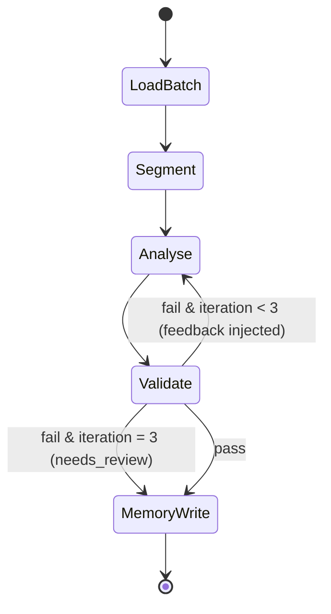
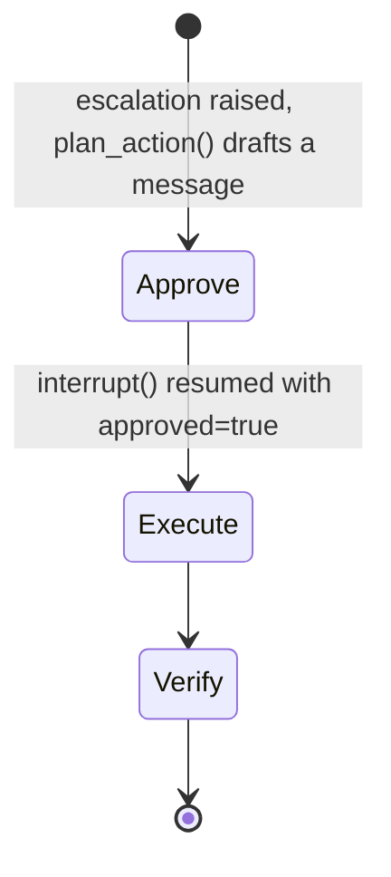

# Agent Design

All agents are LangGraph graphs (or, for the Analyst/Validator, plain async functions wired into one). Every meaningful step is logged to `agent_runs` (agent, node, iteration, status, input/output summary, latency) — the dashboard's **Agent Activity** page renders this log directly, so the loops are inspectable, not just described here.

## 1. Pipeline Supervisor Graph (`agents/pipeline_graph.py`)

`load_batch` (embed any un-embedded messages) and `segment` (deterministic, message-gap/count based) run once per ingestion batch, outside the compiled graph. The compiled graph then runs once per segment, so the Analyst⇄Validator retry loop is segment-scoped.

### Analyst Agent (`agents/analyst.py`)
- Input: a segment's messages, the chat's rolling summary (short-term memory), and — on a retry — the Validator's feedback string.
- Output: `AnalystOutput` (topic, category, sentiment, urgency, `items: list[ExtractedItem]`), each item `{type, title, description, owner_raw, due_date_raw, priority, severity?, likelihood?, status_hint, evidence: [{message_id, quote}], confidence}`, produced via the LLM provider's structured-output call and validated by Pydantic.
- Deterministic helpers called during memory-write (not as agent tool calls, to keep grounding checks reproducible): `resolve_date()` (Asia/Dhaka, handles "kal"/"porshu"/"EOD"/weekday names in English and Bangla) and `resolve_participant()` (fuzzy display-name matching).

### Validator Agent (`agents/validator.py`)
Checks, in order:
1. **Grounding** (deterministic): every evidence quote must fuzzy-match (`SequenceMatcher` ≥ 0.8, or substring) the text of its cited message, and the message must belong to the segment.
2. **LLM judge**: a cheap model call asks "is this really an item, supported by the evidence?" and returns a confidence score; below `0.5` the item fails.

Failures produce a feedback string (e.g. which item, which check) fed back to the Analyst on the next iteration. `report.passed` is `all(v.passed for v in verdicts)`, which is vacuously `True` for a segment with zero extracted items — a segment with nothing to extract is not a failure.

## 2. Monitor Agent (`agents/monitor.py`, loop: observe → detect → emit → recheck)

Runs after every pipeline batch (`workers/jobs.py`) and on a 15-minute cron (`monitor_all` in `workers/settings.py`). Four deterministic rule-based detectors (`services/escalation_rules.py`), each configurable via `PUT /api/settings/rules/{key}`:

| Rule | Trigger |
|---|---|
| `overdue_action` | An open/in-progress action's `due_at` is in the past |
| `unowned_high_risk` | A `severity="high"` risk has no `owner_participant_id` |
| `recurring_issue` | ≥3 fuzzily-similar issue titles (`difflib`, ratio ≥ 0.6) within a 7-day window |
| `sentiment_dip` | 3 consecutive negative-sentiment segments in one chat |

New candidates are deduped against open/acknowledged escalations (by item + chat + rule) before an `Escalation` row is created; escalations whose trigger condition is no longer true are auto-closed (`status="auto_closed"`).

The plan's two LLM-based detectors (decision-reversed, unanswered-question ≥ 4h) are **not implemented** — they need item de-duplication/linking across time that doesn't exist yet, and were explicitly scoped out rather than half-built.

## 3. Action Agent (`agents/action.py`, human-in-the-loop)

- `plan_action()` drafts a message via the LLM and classifies the kind: `notify` (severity ≠ high) **auto-executes immediately** — this matches the plan's "dashboard alert only" path, since a notification needs no approval. `email`/`whatsapp` (severity = high, or an escalation that names an outbound channel) requires manager approval.
- Approval uses a **LangGraph `interrupt`** on a graph checkpointed to Postgres (`agents/checkpoints.py`, `langgraph-checkpoint-postgres`), so a paused run survives an API/worker restart. `POST /api/actions/{id}/approve` (manager-only) resumes it with `Command(resume={"approved": true})`; `POST /api/actions/{id}/reject` stores the manager's feedback and never executes.
- `execute()` calls `services/email.py` (SMTP → Mailpit, or `EMAIL_MODE=simulated`) or `ingestion/cloud_api/sender.py` (Graph API, or `WHATSAPP_MODE=simulated`). A network failure at this step is caught and recorded as `status="failed"` with `requires_review: true` rather than silently retried, since an ambiguous send must not risk a duplicate outbound message.
- `verify()` reads back `action.result`/`status` and logs the outcome.

## 4. Assistant Agent (`agents/assistant.py`, `POST /api/assistant/chat`)

A bounded ReAct-style loop, not the full 7-tool version sketched in the original plan — implemented with **3 tools**: `search_messages` (hybrid search over messages), `query_items` (items with owners/status/sources, optional `overdue`/`type` filters), `get_summary` (recent consolidated summaries). `get_metrics`, `get_entity_profile`, `get_escalations` and `propose_action` were scoped out; the dashboard's own Overview/Escalations pages cover metrics and escalations directly against the same API.

- **Reflection step**: `valid_citations()` requires every `[message-uuid]` citation in the answer to reference a source the agent actually retrieved. If the first draft fails this check, the agent is asked to rewrite using only the retrieved sources; if it still fails, the answer is replaced with an explicit "insufficient evidence" message rather than a possibly-hallucinated one.
- **Thread memory**: `agents/assistant_memory.py`'s `dialogue_graph`, checkpointed per `thread_id` (scoped to the user), threads prior Q&A turns into the next call.
- **Streaming**: `stream: true` on the request returns the (already-computed) answer as SSE token chunks plus a `done` event carrying citations, so the frontend can render incrementally without a second round trip.

## 5. Memory Consolidation (`memory/consolidation.py`, nightly cron)

Not an LLM agent — a deterministic rollup job: builds daily and weekly per-chat `Summary` rows (idempotent upsert, keyed by scope/scope_id/period, re-embeds only when the text actually changed), refreshes each `Entity` profile's active-item list, and flags items with no update in 14 days as `needs_review`.
