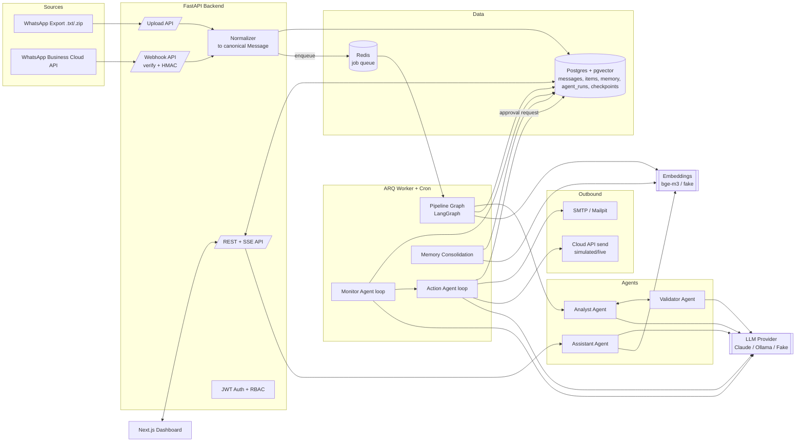

# Architecture

## System diagram

## Processes

The stack runs as four Docker Compose services (`docker-compose.yml`):

- **postgres** — Postgres 16 + pgvector, holds every table (§ [data model](data-model.md)) plus the LangGraph checkpoint tables used by the Action and Assistant agents' durable graphs.
- **redis** — the ARQ job queue only; no other state lives here.
- **backend** — the FastAPI app (`uvicorn app.main:app`), serving `/api/*` and running `alembic upgrade head` on boot.
- **worker** — the same image running `arq app.workers.settings.WorkerSettings`: processes `process_batch` jobs enqueued by ingestion, plus two cron jobs (`monitor_all` every 15 minutes, `consolidate` nightly at 02:00 Asia/Dhaka).
- **frontend** — Next.js dev server serving the dashboard.
- **mailpit** — local SMTP sink so approved email actions are visible without a real mail account.
- **ollama** (optional `local-llm` profile) — local LLM/embedding backend, the no-API-key fallback.

## End-to-end data flow

1. **Ingest.** An export upload (`POST /api/ingest/upload`) or a Cloud API webhook (`POST /api/webhook`, HMAC-verified) is normalized into canonical `Message` rows, deduplicated by content hash / source message id, and a `process_batch` job is enqueued.
2. **Segment.** `services/segmentation.py` groups new messages into conversation segments: a gap over 45 minutes or a 60-message cap closes a segment. Pure/deterministic, no LLM call.
3. **Analyse ⇄ Validate loop.** The LangGraph pipeline (`agents/pipeline_graph.py`) classifies each segment, extracts candidate items, and validates them; failures route back to the Analyst with concrete feedback for up to 3 iterations, then fall through to `needs_review`. See [agents.md](agents.md).
4. **Memory write.** Items are upserted, embeddings written for messages/segments/items, the chat's rolling summary is updated. See [memory.md](memory.md).
5. **Monitor.** Runs after every batch and on a 15-minute cron; rule-based detectors raise or auto-close escalations.
6. **Act.** The Action Agent plans a response, pauses on a LangGraph `interrupt` for outbound actions (email/WhatsApp) until a manager approves via `/api/actions/{id}/approve`, executes, and records the result.
7. **Serve.** The dashboard and Assistant Agent read the same Postgres tables through the REST API and `memory/retrieval.py`'s hybrid search.

## Why these choices

- **LangGraph over a hand-rolled state machine**: every agent loop (pipeline retry, monitor detect/emit/recheck, action plan/approve/execute/verify, assistant dialogue) is a small, inspectable graph, and `agent_runs` logs every node transition for the Agent Activity page — the loops are visible in the demo, not just claimed in docs.
- **Postgres for both relational data and vector/checkpoint state**: one datastore to run and back up; pgvector + `tsvector` cover hybrid search without a separate search service; `langgraph-checkpoint-postgres` gives the Action Agent's approval pause durability across worker restarts for free.
- **A pluggable LLM/embedding layer** (`llm/factory.py`): the whole system runs with zero API keys via the deterministic Fake/Demo providers (used in tests and as the default), and swaps to Claude or local Ollama models through one setting.
