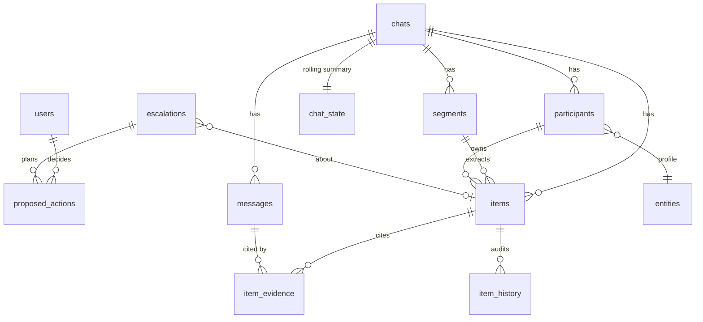

# Data Model

Source of truth: `backend/app/db/models.py`; migrations under `backend/alembic/versions/`. `alembic upgrade head` also creates the LangGraph checkpoint tables (`checkpoints`, `checkpoint_writes`, `checkpoint_blobs`) via `setup_checkpoints()`, used by the Action and Assistant agents' durable graphs — not listed below since LangGraph owns their schema.

## Core tables

| Table | Key columns | Notes |
|---|---|---|
| `users` | email, name, role (`manager`\|`analyst`), password_hash | bcrypt via `core/security.py` |
| `chats` | source (`export`\|`cloud_api`), name, type, external_id, timezone | `external_id` is a salted hash of the business/customer number pair, not a raw phone number |
| `participants` | chat_id, display_name, phone_hash, phone_masked, entity_id | phone numbers are hashed + masked (last 4 digits only), never stored raw |
| `chat_state` | chat_id (unique), rolling_summary, last_message_ts | short-term memory (`memory/short_term.py`) |
| `messages` | chat_id, participant_id, source_message_id, ts, text, media_type, is_system, reply_to_id, raw jsonb, **content_hash unique**, embedding `vector(1024)`, tsv `tsvector` (config `simple`) | idempotency key is `content_hash`; export uploads hash `chat_id\|ts\|sender\|text`, webhook messages hash `cloud_api\|business_number\|source_message_id` |
| `segments` | chat_id, start_ts, end_ts, message_ids[], topic, category, sentiment, urgency, summary, embedding, analysis_status | closed by a 45-minute gap or a 60-message cap (deterministic, no LLM) |
| `items` | type (`action`\|`decision`\|`risk`\|`issue`), title, description, chat_id, segment_id, owner_participant_id, owner_raw, due_at, due_raw, status, priority, severity, likelihood, confidence, validation_status, embedding | `validation_status`: `pending` → `passed` \| `needs_review` |
| `item_evidence` | item_id, message_id, quote | the grounding record the Validator checks and the Assistant cites |
| `item_history` | item_id, change jsonb, source_message_id, actor (`agent`\|`user`), ts | e.g. `PATCH /api/items/{id}/status` writes `{"field": "status", "from": ..., "to": ...}` |
| `entities` | kind (`person`\|`project`\|`client`\|`topic`), name, aliases[], profile jsonb, embedding | `entity_mentions` links entities back to messages |
| `summaries` | scope (`day`\|`week`), scope_id, period_start, period_end, text, embedding | nightly consolidation output |
| `escalations` | rule, severity, item_id?, chat_id?, rationale, evidence jsonb, status (`open`\|`acknowledged`\|`resolved`\|`auto_closed`) | one row per Monitor Agent detection |
| `proposed_actions` | escalation_id?, kind (`notify`\|`email`\|`whatsapp`\|`status_update`), payload jsonb, status (`pending`\|`approved`\|`rejected`\|`executing`\|`executed`\|`failed`), decided_by, decided_at, edit jsonb, result jsonb, thread_id | `thread_id` is the LangGraph checkpoint thread for the paused approval graph |
| `notifications` | user_id?, role?, title, body, link, read_at | dashboard-only alerts (the Action Agent's `notify` kind) |
| `agent_runs` | run_id, agent, node, iteration, status, input_summary, output_summary, model, tokens_in/out, latency_ms, error, ts | every agent loop's execution log; powers Agent Activity |
| `ingestion_jobs` | source, filename, status, stats jsonb, error | one row per export upload |
| `rules` | key (unique), params jsonb, enabled | Monitor detector thresholds, editable via Settings |
| `feedback` | kind, target_id, user_id, payload jsonb | manager approve/reject rationale, analyst corrections |
| `audit_log` | user_id?, action, details jsonb, ts | e.g. `settings.rule_update` |

## Indexing

- `messages.embedding`: HNSW (pgvector) for cosine similarity search.
- `messages.tsv`: GIN, generated column on `to_tsvector('simple', text)` — `simple`, not `english`, so Bangla script and Banglish tokens aren't mangled by English stemming (`memory/retrieval.py` fuses both rankings with RRF).
- `items.embedding`, `segments.embedding`, `entities.embedding`, `summaries.embedding`: HNSW, same pattern.
- `messages.content_hash`: unique, the idempotency guarantee for re-uploaded/replayed messages.
